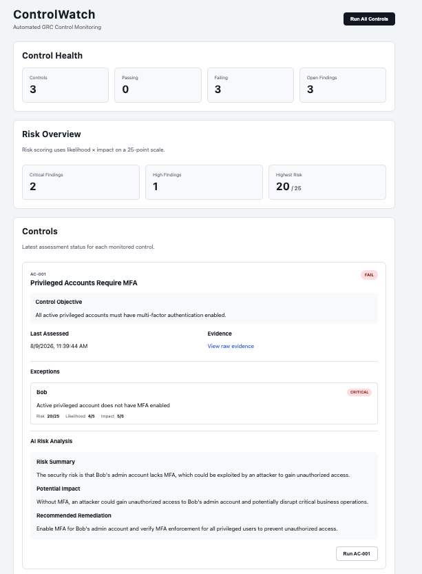

# ControlWatch

**Automated GRC Control Monitoring on Cloudflare**

ControlWatch is a serverless security control monitoring platform that automatically evaluates identity-security controls, preserves assessment evidence, tracks risk findings, and generates AI-assisted risk analysis.

> **Control determination is deterministic. AI is used only for interpretation.**
>
> ControlWatch never relies on an LLM to determine whether a security control passes or fails.

## Live Demo

**https://controlwatch.bhavjotsingh4233.workers.dev**

## Dashboard



## Overview

Traditional GRC control testing can involve manually collecting evidence, evaluating controls, documenting findings, and communicating risk.

ControlWatch demonstrates how that workflow can be automated using the Cloudflare developer platform.

For each assessment, ControlWatch:

1. Collects synthetic identity-security data.
2. Evaluates the data using deterministic security control logic.
3. Produces a `PASS`, `FAIL`, or `ERROR` result.
4. Stores assessment results and findings in Cloudflare D1.
5. Preserves raw assessment evidence in Cloudflare R2.
6. Calculates likelihood, impact, and risk scores for findings.
7. Uses Cloudflare Workers AI to generate risk summaries and remediation guidance.
8. Displays control health, evidence, findings, and risk through a monitoring dashboard.

---

## Architecture

```text
              ┌──────────────────────┐
              │ Synthetic Identity   │
              │ Security Data        │
              └─────────┬────────────┘
                        │
                        ▼
              ┌──────────────────────┐
              │ Cloudflare Worker    │
              │                      │
              │ API + Orchestration  │
              └─────────┬────────────┘
                        │
                        ▼
              ┌──────────────────────┐
              │ Deterministic        │
              │ Control Engine       │
              │                      │
              │ AC-001               │
              │ AC-002               │
              │ AC-003               │
              └─────┬─────────┬──────┘
                    │         │
              PASS  │         │ FAIL
                    │         │
                    ▼         ▼
              ┌──────────────────────┐
              │ Cloudflare D1        │
              │                      │
              │ Assessments          │
              │ Findings             │
              │ Risk Scores          │
              │ Remediation          │
              └──────────────────────┘
                    │
          ┌─────────┴──────────┐
          ▼                    ▼
┌─────────────────┐   ┌──────────────────┐
│ Cloudflare R2   │   │ Workers AI       │
│                 │   │                  │
│ Raw Evidence    │   │ Risk Analysis    │
└─────────────────┘   └──────────────────┘
          │                    │
          └─────────┬──────────┘
                    ▼
           ┌───────────────────┐
           │ GRC Dashboard     │
           │                   │
           │ Control Health    │
           │ Risk              │
           │ Evidence          │
           │ Findings          │
           │ Remediation       │
           └───────────────────┘
```

---

## Cloudflare Stack

### Cloudflare Workers

Cloudflare Workers provide the application's API and orchestration layer.

The Worker:

- Executes security controls
- Coordinates assessment workflows
- Writes assessment data to D1
- Stores raw evidence in R2
- Invokes Workers AI
- Serves API endpoints used by the dashboard

### Cloudflare D1

D1 provides the relational persistence layer for:

- Assessment history
- Control results
- Findings
- Severity
- Likelihood and impact
- Risk scores
- Finding owners
- Due dates
- Remediation plans
- Resolution status

This allows ControlWatch to maintain assessment history and track findings over time rather than returning only one-time control results.

### Cloudflare R2

R2 stores the raw evidence associated with assessments.

Evidence is stored using assessment-specific object keys:

```text
AC-001/assessment-25.json
AC-002/assessment-26.json
AC-003/assessment-27.json
```

This separates structured assessment metadata in D1 from the raw evidence supporting each assessment.

### Cloudflare Workers AI

Workers AI provides the interpretation layer for failed security controls.

After the deterministic control engine produces a result, Workers AI receives structured information about the finding and generates:

- Risk Summary
- Potential Impact
- Recommended Remediation

Workers AI does **not** determine whether a control passes or fails.

This separation is intentional. Conditions such as whether an active administrator has MFA enabled are objectively measurable and should be evaluated using deterministic code.

AI is used downstream where natural-language interpretation is useful.

---

## Security Controls

ControlWatch currently implements three internal demonstration controls.

### AC-001 — Privileged Accounts Require MFA

**Objective:** All active privileged accounts must have multi-factor authentication enabled.

Example:

```text
User: Bob
Role: Admin
Active: Yes
MFA: Disabled

Result: FAIL
```

### AC-002 — Terminated Employees Must Not Retain Active Accounts

**Objective:** Accounts belonging to terminated employees must be deactivated.

Example:

```text
User: Dave
Employment Status: Terminated
Account Active: Yes

Result: FAIL
```

### AC-003 — Privileged Access Reviews

**Objective:** Active privileged accounts must have an access review completed within the previous 90 days.

Example:

```text
User: Bob
Role: Admin
Last Access Review: More than 90 days ago

Result: FAIL
```

The `AC-001`, `AC-002`, and `AC-003` identifiers are internal ControlWatch identifiers created for this demonstration. They are not presented as control identifiers from a specific compliance framework.

---

## Deterministic Controls + AI Interpretation

A core design principle of ControlWatch is separating **determination** from **interpretation**.

### Determination

```text
Identity Data
     ↓
Deterministic Control Logic
     ↓
PASS / FAIL / ERROR
```

For example:

```text
Active administrator
+
MFA disabled
=
FAIL
```

No AI is required to make that decision.

### Interpretation

```text
Structured Finding
     ↓
Workers AI
     ↓
Risk Summary
Potential Impact
Recommended Remediation
```

This architecture prevents an LLM from changing or hallucinating an objectively measurable security-control result while still taking advantage of AI for communicating risk.

---

## PASS, FAIL, and ERROR

ControlWatch distinguishes between three assessment states:

```text
PASS
FAIL
ERROR
```

**PASS** — available evidence satisfies the control.

**FAIL** — the evidence contains one or more deterministic control exceptions.

**ERROR** — the system was unable to complete the assessment successfully.

The distinction between `FAIL` and `ERROR` is important.

If evidence collection fails, ControlWatch should not assume that the underlying security control passed or failed. Instead, the assessment can be represented as an error or inability to assess.

---

## Risk Scoring

ControlWatch uses a simple demonstration risk model:

```text
Risk Score = Likelihood × Impact
```

Likelihood and impact are each scored from 1–5.

Example:

```text
Likelihood: 4 / 5
Impact:     5 / 5

Risk Score: 20 / 25
Severity:   Critical
```

The scoring system is an internal ControlWatch demonstration methodology and is not presented as Cloudflare's risk-scoring methodology.

---

## Finding & Remediation Tracking

Failed controls generate findings containing information such as:

```text
Control
Subject
Description
Severity
Likelihood
Impact
Risk Score
Owner
Due Date
Remediation Plan
Status
```

Example:

```text
Control: AC-001
Subject: Bob

Issue:
Active privileged account does not have MFA enabled.

Severity: Critical
Risk Score: 20 / 25

Owner:
Identity Security

Remediation:
Enable MFA for the affected privileged account and
verify MFA enforcement for all privileged users.

Status:
OPEN
```

This represents a simplified GRC lifecycle:

```text
Control
   ↓
Assessment
   ↓
Evidence
   ↓
Finding
   ↓
Risk
   ↓
Owner
   ↓
Remediation
   ↓
Resolution
```

---

## Assessment Flow

An AC-001 assessment follows this general flow:

```text
Run AC-001
     ↓
Worker loads identity data
     ↓
Control engine evaluates active privileged users
     ↓
Bob has MFA disabled
     ↓
AC-001 = FAIL
     ↓
Assessment saved to D1
     ↓
Raw evidence saved to R2
     ↓
Finding created or updated
     ↓
Risk score calculated
     ↓
Workers AI generates risk analysis
     ↓
Dashboard displays the result
```

---

## Dashboard

The ControlWatch dashboard provides visibility into:

- Overall control health
- Passing and failing controls
- Open findings
- Critical and high-risk findings
- Risk scores
- Control exceptions
- AI-generated risk analysis
- Finding ownership
- Remediation plans
- Due dates
- Assessment history
- Raw assessment evidence

The frontend intentionally uses lightweight HTML, CSS, and JavaScript rather than a large frontend framework.

---

## Project Structure

```text
controlwatch/
├── public/
│   ├── index.html
│   ├── app.js
│   └── style.css
│
├── screenshots/
│   └── dashboard.png
│
├── src/
│   ├── index.ts
│   ├── control.ts
│   └── data.ts
│
├── schema.sql
├── wrangler.jsonc
├── package.json
└── README.md
```

---

## Running Locally

### 1. Install dependencies

```bash
npm install
```

### 2. Generate Cloudflare binding types

```bash
npx wrangler types
```

### 3. Initialize the local D1 database

```bash
npx wrangler d1 execute controlwatch-db --local --file=./schema.sql
```

### 4. Start the development server

```bash
npm run dev
```

The application will be available at:

```text
http://localhost:8787
```

---

## Deployment

Initialize the production D1 schema when setting up a new environment:

```bash
npx wrangler d1 execute controlwatch-db --remote --file=./schema.sql
```

Deploy the application:

```bash
npx wrangler deploy
```

The deployed Worker connects to the configured production D1 database, R2 bucket, Workers AI binding, and static dashboard assets.

---

## Tech Stack

- TypeScript
- Cloudflare Workers
- Cloudflare Workers AI
- Cloudflare D1
- Cloudflare R2
- Wrangler
- HTML
- CSS
- JavaScript

---

## Key Design Decisions

### Deterministic compliance decisions

AI never decides whether a control passes or fails. Security conditions are evaluated using deterministic application logic.

### Evidence separated from assessment metadata

D1 stores structured assessment and finding information while R2 stores the raw evidence supporting each assessment.

### AI as an interpretation layer

Workers AI translates structured technical findings into concise risk explanations and remediation guidance.

### Monitoring failures are explicit

The assessment model distinguishes `ERROR` from `PASS` and `FAIL`, preventing evidence-collection problems from being interpreted as security-control results.

### Serverless architecture

ControlWatch uses Cloudflare's developer platform for compute, relational persistence, object storage, AI inference, and application delivery.

---

## What This Project Demonstrates

ControlWatch demonstrates how serverless infrastructure and AI can be combined to automate part of the GRC control-monitoring lifecycle while keeping objective security decisions deterministic.

The project integrates:

**Cloudflare Workers → D1 → R2 → Workers AI → Dashboard**

into a single deployed application for assessing controls, preserving evidence, identifying risk, and communicating findings.